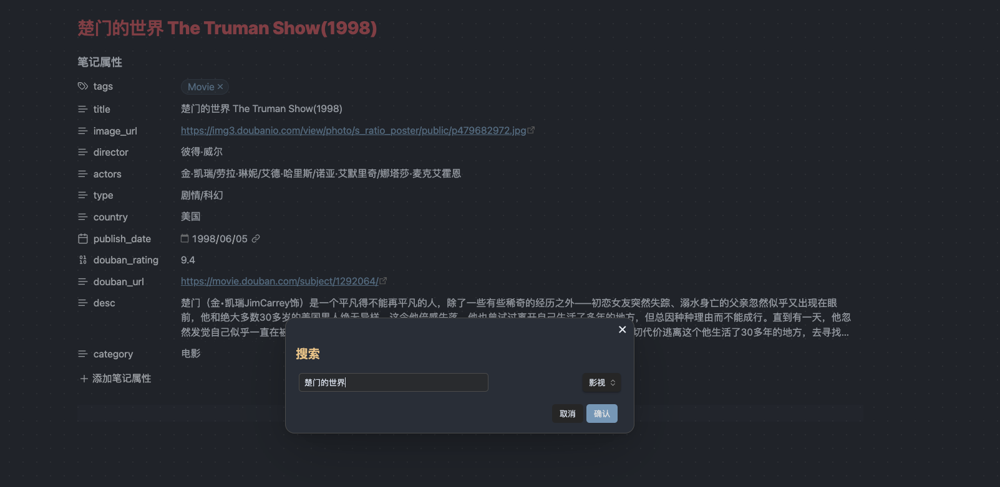
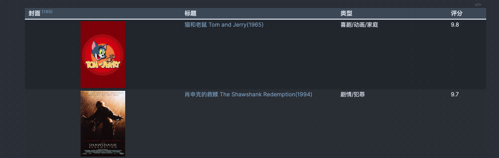

# Obsidian豆瓣插件

可以搜索豆瓣中的内容，如电影、游戏、书籍，之后会创建一个Obsidian文档保存这些信息。

随后你可以通过诸如DataView等插件做展示。

## 插件开发流程

- Clone your repo to a local development folder. For convenience, you can place this folder in your `.obsidian/plugins/your-plugin-name` folder.
- Install NodeJS, then run `npm i` in the command line under your repo folder.
- Run `npm run dev` to compile your plugin from `main.ts` to `main.js`.
- Make changes to `main.ts` (or create new `.ts` files). Those changes should be automatically compiled into `main.js`.
- Reload Obsidian to load the new version of your plugin.
- Enable plugin in settings window.
- For updates to the Obsidian API run `npm update` in the command line under your repo folder.

## Manually installing the plugin

- Copy over `main.js`, `styles.css`, `manifest.json` to your vault `VaultFolder/.obsidian/plugins/your-plugin-id/`.

## API Documentation

See https://github.com/obsidianmd/obsidian-api
